# MedAgent Harness

A traceable clinical-domain agent harness for context engineering, centralized
planning and routing, multi-agent execution, clinical retrieval, session
memory, conservative runtime guardrails, and replayable observability.

> Demo screenshot/GIF placeholder — run `medagent serve`, then build or serve
> `web/` to capture the Patient, Clinical, and Developer views.

## Why this project

Many agent demos hide the hard engineering between a case and an answer. This
repository makes that control plane explicit. An **Answer Contract** records
what the user asked for. An **Evidence Ledger** records what the case actually
establishes; it is not a medical knowledge graph. A centralized planner assigns
dispatchable work to Diagnostic, Consultation, and Research workers. Every
public execution decision is written to a replayable trace.

This is an engineering demonstration, not a medical device or an autonomous
doctor. It is not intended for production clinical deployment.

## Architecture

```mermaid
flowchart LR
  C[Case] --> X[Context + session memory]
  X --> P[Answer Contract + Evidence Ledger]
  P --> L[Central Planner]
  L --> A[Diagnostic / Consultation / Research workers]
  A --> T[Allowlisted tools + clinical RAG]
  T --> S[Synthesis]
  S --> G[Checker + conservative patch + sanitizer]
  G --> O[Professional answer]
  O --> V[Presentation adapter]
  V --> R[Trace + replay]
```



The stable route is the **Centralized Planner–Worker Multi-Agent Architecture**
frozen in `experiment_freeze_v2`. It selects a single worker when one specialty
is sufficient and multiple workers only for dispatchable multi-domain work.
Parsing failures fall back to a deterministic, valid plan.

## Key features

- Contract-driven context and an explicit Evidence Ledger
- Centralized planner–worker single/multi-agent routing
- Deterministic retrieval query builder, configurable CollectionRouter, unified
  `EvidenceItem`, admission threshold, and compact worker evidence
- Explicit procedural-skill loading, separate from tool schemas
- Session memory with trimming, exact adjacent deduplication and current-input
  priority
- Conservative checker/Stable-ID patch boundary and output sanitizer
- Full trace summaries and offline replay without exposing private reasoning
- FastAPI, CLI, synthetic examples, and a three-view React demonstration

Long-term memory is intentionally not enabled in the stable release.
`search_similar_cases` is neither visible nor executable. No Mem0 client is
initialized.

## Demo

- **Patient View:** short deterministic summary, admitted evidence and safety
  notice; necessary risks remain visible.
- **Clinical View:** complete professional answer and source-faithful Evidence
  Cards. Missing source fields display `Source metadata unavailable`.
- **Developer View:** context, contract, ledger, plan, route, tool/retrieval
  events, worker status, checker edits, tokens and latency. It does not display
  chain-of-thought.

The bundled sample trace works without an API key. The default retrieval
backend is offline-safe and returns no evidence rather than fabricating it.

## Quick start

Requires Python 3.11+.

```bash
python -m venv .venv
# Windows: .venv\Scripts\activate
# POSIX: source .venv/bin/activate
pip install -e ".[dev]"
medagent run examples/synthetic_case_1.json
medagent trace examples/sample_trace/sample-run
medagent replay examples/sample_trace/sample-run
medagent serve
```

API examples:

```bash
curl http://127.0.0.1:8000/health
curl -X POST http://127.0.0.1:8000/api/analyze \
  -H "Content-Type: application/json" \
  -d '{"description":"SYNTHETIC EXAMPLE — fatigue","question":"What should be assessed?","session_id":"demo"}'
```

Frontend:

```bash
cd web
npm install
npm run build
```

During local development, proxy `/api` to port 8000 or host the built frontend
behind the same origin as FastAPI.

## Example trace

Trace JSONL contains lifecycle events such as `run_start`, `context`, `memory`,
`contract`, `ledger`, `plan`, `route`, retrieval, worker drafts, synthesis,
checker, patch, `final_answer`, and `run_end/error`. It records observable
inputs, outputs and execution decisions—not hidden chain-of-thought. See
[`examples/sample_trace/sample-run`](examples/sample_trace/sample-run).

## Evaluation

The historical **CMB-Clin COMPOSITE-20 development benchmark** reported 20/20
execution success, 90% RouteExactAccuracy, 97.22% worker micro-F1, a 100%
dispatchable-plan rate, and zero timeout/generation failures. These are fixed
development-benchmark engineering results, not unseen-holdout or medical-quality
claims. Methods, scope and comparison caveats are in [`docs/evaluation.md`](docs/evaluation.md).

Default local validation is offline:

```bash
ruff check .
pytest -m "not integration"
```

## Project structure

```text
medagent/        runtime, context, planning, agents, retrieval, tools,
                 memory, guardrails, observability, presentation, skills
api/             FastAPI routes and request/response schemas
web/             React + TypeScript + Vite three-view demo
eval/            public evaluation schemas and scoring code (no benchmark data)
examples/        synthetic cases and an offline sample trace
tests/           offline unit/API tests
docs/            architecture, baseline, decisions, evaluation and audits
```

## Design decisions

The harness preserves the freeze-v2 behavior boundary instead of introducing a
new graph runtime, reflection loop, long-term vector memory, agent role, or
prompt policy. Detection does not imply permission to rewrite an answer;
ambiguous units are preserved. See [`docs/design-decisions.md`](docs/design-decisions.md).

## Limitations

- Offline mode demonstrates orchestration and produces no new clinical facts.
- External LLM and Milvus adapters are deployment-specific extension points.
- Retrieval quality depends on a separately licensed, validated corpus.
- Guardrails do not eliminate hallucination or guarantee medical correctness.
- Sample cases are synthetic and are not evidence of clinical performance.

## License / attribution

`REDISTRIBUTION_LICENSE_UNVERIFIED`. The source repository has a README license
statement but no root license instrument was found. Publication is blocked
until authorization is confirmed. See [`LICENSE_PENDING.md`](LICENSE_PENDING.md)
and [`docs/OPEN_SOURCE_STATUS.md`](docs/OPEN_SOURCE_STATUS.md).

