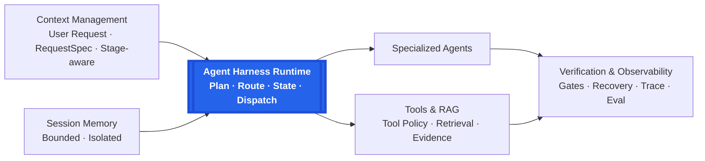

# MedAgent Harness

A native multi-agent clinical decision-support harness with context engineering, planning, agent orchestration, tool and retrieval loops, session memory, verification, reliability control, observability, and evaluation.

MedAgent Harness is an agent-runtime engineering project for traceable clinical-domain workflows. It is not a medical device, does not replace qualified clinical judgment, and does not guarantee a diagnosis.

## Why MedAgent Harness?

A direct LLM call can blur a complex clinical request into one generation: explicit deliverables may be dropped, tools may be invoked without clear bounds, and failures are difficult to inspect. MedAgent turns the request into an execution contract, decomposes and routes the work, gives specialized agents bounded context and capabilities, and verifies completion before returning an answer.

**The core contribution is the harness around the LLM rather than a new foundation model.** The harness owns request structuring, routing, planning, worker dispatch, tool execution, context construction, state handling, verification, recovery, and tracing.

## Architecture



The core contribution is an agent harness around LLMs, providing context construction, planning, orchestration, tool execution, verification, recovery and observability.

The harness constructs context according to execution stage; it does not reuse one oversized prompt everywhere:

- `RequestSpec` preserves the user's explicit deliverables, while `AnswerContract` identifies required clinical coverage.
- The Planner receives task-level context; workers receive role-specific assignments, the current request, bounded session context, and admitted evidence only when needed.
- Tools and optional retrieval add evidence through the controlled worker loop.
- Session Memory provides bounded, process-local conversation context from the current session to Planner and worker execution; it is not a persistent fact store.
- Protocol recovery receives only the malformed output, assigned request IDs, and required response schema. It repairs serialization rather than redoing clinical reasoning or reinjecting the full case.

See [Architecture](docs/ARCHITECTURE.md) for the detailed execution and failure model.

## Engineering Capabilities

| Capability | Implementation |
| --- | --- |
| Context Engineering | `RequestSpec`, `AnswerContract`, and stage-aware context construction |
| Planning | Task decomposition and complexity-aware routing |
| Multi-Agent | Specialized worker ownership and centralized orchestration |
| Tool Use | Schema-filtered execution with a per-worker call budget |
| Retrieval | Optional RAG with query routing, evidence admission, and compact injection |
| Memory | Bounded, process-local, session-scoped context injection |
| Guardrails | Request coverage, Answer Contract, completion gate, and stable patching |
| Reliability | Bounded infrastructure retries with backoff and worker protocol recovery |
| Observability | Structured execution traces with model events, tools, usage, latency, and recovery |
| Evaluation | Reliability benchmark, quality comparison, and failure analysis |

## Key Reliability Design

Two bounded worker recovery paths are emphasized:

1. **Infrastructure retry** handles transient provider or network failures such as transport errors, rate limits, and server errors with at most two retries and exponential backoff.
2. **Worker protocol recovery** handles non-empty semantic content that fails the required structured-output protocol.

Protocol recovery is limited to one attempt. It does not rerun the Planner, replay tools, or trigger a quality retry, and its output must pass the same parser and completion gates as the original worker response. Stage-specific generation-length handling is also bounded and is documented in [Architecture](docs/ARCHITECTURE.md#8-reliability-control).

## Evaluation

| Fixed 60-case development evaluation | Result |
| --- | ---: |
| Reliability | **59 / 60 completed** |
| MedAgent clinical decision-support quality | **4.6733 / 5** |
| DeepSeek Web saved-output baseline | **4.3883 / 5** |
| Delta | **+0.2850 / +6.49%** |

The largest gains were in:

- Completeness: **+0.7166**
- Workflow: **+0.7000**

This comparison measures clinical decision-support quality on a fixed 60-case development evaluation set. It is not an unseen test, independent clinical validation, or evidence of general medical intelligence. Retrieval is optional and is not claimed as the primary source of the reported improvement. See [Benchmark](docs/BENCHMARK.md), [Reliability](docs/RELIABILITY.md), and [Failure analysis](docs/FAILURE_ANALYSIS.md).

## Interactive Demo

A static frontend showcase is available:

[MedAgent Showcase Demo](https://young-svg.github.io/medagent-harness/)

- Loads bundled local fixtures.
- Requires no backend or API keys.
- Makes no API or external inference calls.

This page demonstrates the Agent workflow and UI presentation only. It is an engineering portfolio showcase, not an online medical service.

## Quick Start

Requires Python 3.11+.

```bash
python -m venv .venv
# POSIX: source .venv/bin/activate
# Windows: .venv\Scripts\activate
pip install -e ".[dev]"

medagent run examples/synthetic_case_1.json
```

Without an external model endpoint, the harness uses its deterministic local client for workflow smoke tests. Copy `.env.example` only when configuring an OpenAI-compatible endpoint; never commit `.env`.

### Optional RAG / Retrieval

Retrieval is an optional runtime capability, not a requirement for the base harness. Real Milvus retrieval requires the `retrieval` extra and a corpus the user is authorized to use and govern. This repository does not distribute a local medical knowledge base or raw guideline corpus, and it does not present the synthetic RAG fixtures as an authoritative guideline database.

## Demo

Run the same fixture-only showcase locally:

```bash
cd web
npm ci
npm run dev
```

The frontend presents four synthetic scenarios: single-agent routing, multi-agent collaboration, optional RAG, and same-session memory. It loads only local fixtures and does not call the backend. See the [Static demo](docs/STATIC_DEMO.md), [Static demo audit](docs/STATIC_DEMO_AUDIT.md), and [Demo guide](docs/DEMO.md).

## Documentation

- [Architecture](docs/ARCHITECTURE.md)
- [Design](docs/DESIGN.md)
- [Benchmark](docs/BENCHMARK.md)
- [Reliability](docs/RELIABILITY.md)
- [Failure analysis](docs/FAILURE_ANALYSIS.md)
- [Demo guide](docs/DEMO.md)
- [Static demo](docs/STATIC_DEMO.md)
- [Static demo audit](docs/STATIC_DEMO_AUDIT.md)

## Repository Layout

```text
api/                 FastAPI boundary
docs/                Architecture, evaluation, reliability, and demo documentation
eval/                Reusable evaluation schemas and scoring utilities
examples/demo_cases/ Synthetic showcase fixtures
medagent/            Context, planning, runtime, agents, tools, retrieval, and verification
tests/               Deterministic unit and integration-contract tests
web/                 React/Vite frontend
```

## Validation

```bash
pytest
ruff check medagent tests

cd web
npm ci
npm run build
```

CI runs offline and does not require a model endpoint, vector database, patient dataset, or private corpus.

## Public-release Data Policy

This repository does not distribute patient records, benchmark case text, candidate-answer dumps, private medical corpora, vector databases, model weights, credentials, or local traces. Demo inputs and evidence cards are synthetic fixtures.

## License

This repository is provided for public viewing and evaluation.

No open-source license is granted at this time.

Third-party components remain subject to their respective licenses.
