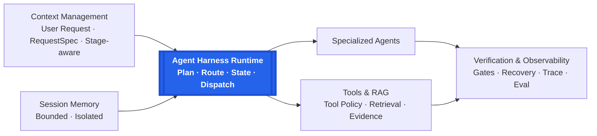

# MedAgent Harness

MedAgent Harness is a native multi-agent runtime for clinical decision-support workflows. Rather than training a new foundation model, it controls how LLM agents execute a request: structuring requirements, planning and routing work, constructing bounded context, running specialized workers and tools, optionally retrieving evidence, verifying completion, recovering from bounded failures, and recording traces.

Built as an agent-engineering portfolio project, it is not a medical device, does not replace qualified clinical judgment, and does not guarantee a diagnosis.

## Why MedAgent Harness?

Direct LLM generation can miss explicit deliverables in a complex request. Tools, context, and multi-step execution also become difficult to bound, while failures are hard to locate and recover.

**The core contribution is the Harness control layer:** it converts each user request into an explicit execution contract and controls the Agent lifecycle from planning and stage-aware context construction through worker dispatch, tool execution, verification, recovery, and tracing.

## Architecture



## How One Request Runs

**User Request → RequestSpec + AnswerContract → Planner / Router → Specialized Worker(s) → Tools / optional RAG / bounded session context when needed → Request Coverage + Answer Contract completion gates → Final Answer + Execution Trace**

- `RequestSpec` preserves the user's explicit requirements and deliverables.
- `AnswerContract` defines the clinical dimensions the final answer must cover.
- The Planner decomposes and routes work according to request complexity.
- Each worker receives role-relevant, stage-aware bounded context rather than one shared oversized prompt.
- Tools and optional RAG inject evidence only through the controlled worker loop; session memory remains bounded, process-local, and session-scoped.
- Final output must pass request-coverage and Answer Contract completion gates, with execution recorded in a structured trace.

See [Architecture](docs/ARCHITECTURE.md) for the detailed execution and failure model.

## Engineering Capabilities

| Capability | Implementation |
| --- | --- |
| Context Engineering | `RequestSpec`, `AnswerContract`, and stage-aware context construction |
| Planning | Task decomposition and complexity-aware routing |
| Multi-Agent | Specialized worker ownership and centralized orchestration |
| Tool Use | Schema-filtered execution with a per-worker call budget |
| Retrieval | Optional RAG with query routing, evidence admission, and compact injection |
| Memory | Bounded, process-local, session-scoped context injection |
| Guardrails | Request coverage, Answer Contract, completion gate, and stable patching |
| Reliability | Bounded infrastructure retries with backoff and worker protocol recovery |
| Observability | Structured execution traces with model events, tools, usage, latency, and recovery |
| Evaluation | Reliability benchmark, quality comparison, and failure analysis |

## Key Reliability Design

Two bounded worker recovery paths are emphasized:

1. **Infrastructure retry** handles transient provider or network failures such as transport errors, rate limits, and server errors with at most two retries and exponential backoff.
2. **Worker protocol recovery** handles non-empty semantic content that fails the required structured-output protocol.

Protocol recovery is limited to one serialization-repair attempt. It does not rerun the Planner, replay tools, or trigger a quality retry. Its output must pass the same parser, request-coverage gate, and Answer Contract gate as the original worker response. Stage-specific generation-length handling is also bounded and is documented in [Architecture](docs/ARCHITECTURE.md#8-reliability-control).

This mechanism was introduced after failure analysis of an early 20-case run: two incomplete cases contained clinically relevant worker content but failed at the structured-response boundary. The root cause was malformed serialization and parser rejection—not medical reasoning, planning, or network failure—so the fix targeted bounded serialization recovery without rerunning planning, tools, or clinical reasoning. The final fixed 60-case valid-execution set completed 60/60; this is not a claim of perfect reliability. See [Failure analysis](docs/FAILURE_ANALYSIS.md) for details.

## Evaluation

| Fixed 60-case development evaluation | Result |
| --- | ---: |
| Reliability | **60 / 60 completed** |
| MedAgent clinical decision-support quality | **4.6733 / 5** |
| DeepSeek Web saved-output baseline | **4.3883 / 5** |
| Delta | **+0.2850 / +6.49%** |

The largest gains were in:

- Completeness: **+0.7166**
- Workflow: **+0.7000**

MedAgent and the DeepSeek Web baseline used the same underlying DeepSeek model. This is a paired complete-system comparison of different orchestration, context-management, and execution pipelines rather than foundation-model scale or family. Because DeepSeek Web's internal configuration is not observable, this is not a strict component-level causal ablation, and the **+6.49%** delta is not attributed solely to the Harness.

Runs followed a frozen validity policy: valid model responses were never regenerated for answer quality or manually edited; detailed methodology is documented in [Benchmark](docs/BENCHMARK.md) and [Reliability](docs/RELIABILITY.md).

This comparison measures clinical decision-support quality on a fixed 60-case development evaluation set. It is not an unseen test, independent clinical validation, or evidence of general medical intelligence. Retrieval is optional and is not claimed as the primary source of the reported improvement.

## Demo

[MedAgent Showcase Demo](https://young-svg.github.io/medagent-harness/)

The frontend presents four bundled synthetic scenarios: single-agent routing, multi-agent collaboration, optional RAG, and same-session memory.

- Fixture-only; no backend required.
- No API keys.
- No external inference calls.
- Engineering portfolio showcase, not an online medical service.

### Run the showcase locally

```bash
cd web
npm ci
npm run dev
```

See the [Static demo](docs/STATIC_DEMO.md), [Static demo audit](docs/STATIC_DEMO_AUDIT.md), and [Demo guide](docs/DEMO.md).

## Quick Start

Requires Python 3.11+.

```bash
python -m venv .venv
# POSIX: source .venv/bin/activate
# Windows: .venv\Scripts\activate
pip install -e ".[dev]"

medagent run examples/synthetic_case_1.json
```

Without an external model endpoint, the harness uses its deterministic local client for workflow smoke tests. Copy `.env.example` only when configuring an OpenAI-compatible endpoint; never commit `.env`.

### Optional RAG / Retrieval

Retrieval is an optional runtime capability, not a requirement for the base harness. Real Milvus retrieval requires the `retrieval` extra and a corpus the user is authorized to use and govern. This repository does not distribute a local medical knowledge base or raw guideline corpus, and it does not present the synthetic RAG fixtures as an authoritative guideline database.

## Documentation

- [Architecture](docs/ARCHITECTURE.md)
- [Design](docs/DESIGN.md)
- [Benchmark](docs/BENCHMARK.md)
- [Reliability](docs/RELIABILITY.md)
- [Failure analysis](docs/FAILURE_ANALYSIS.md)
- [Demo guide](docs/DEMO.md)
- [Static demo](docs/STATIC_DEMO.md)
- [Static demo audit](docs/STATIC_DEMO_AUDIT.md)

## Repository Layout

```text
api/                 FastAPI boundary
docs/                Architecture, evaluation, reliability, and demo documentation
eval/                Reusable evaluation schemas and scoring utilities
examples/demo_cases/ Synthetic showcase fixtures
medagent/            Context, planning, runtime, agents, tools, retrieval, and verification
tests/               Deterministic unit and integration-contract tests
web/                 React/Vite frontend
```

## Validation

```bash
pytest
ruff check medagent tests

cd web
npm ci
npm run build
```

CI runs offline and does not require a model endpoint, vector database, patient dataset, or private corpus.

## Public-release Data Policy

This repository does not distribute patient records, benchmark case text, candidate-answer dumps, private medical corpora, vector databases, model weights, credentials, or local traces. Demo inputs and evidence cards are synthetic fixtures.

## License

This repository is provided for public viewing and evaluation.

No open-source license is granted at this time.

Third-party components remain subject to their respective licenses.
