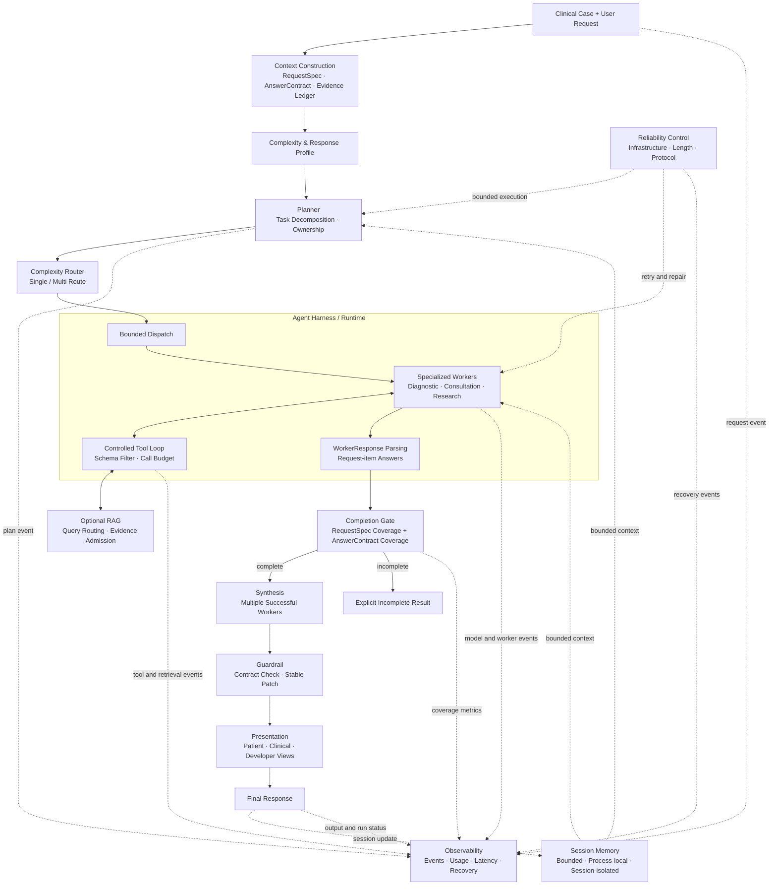

# Architecture

## System Objective

MedAgent Harness is a centralized planner-worker runtime for traceable clinical decision-support workflows. Its objective is not autonomous diagnosis or a new foundation model. It turns a compound request into explicit work, runs that work through bounded agent and tool loops, verifies completion, and records the observable execution lifecycle.

## Execution Model

For a single successful worker, the harness can use the worker answer directly instead of running multi-worker synthesis. Both paths still pass through the guardrail and presentation stages.

## 1. Request Structuring and Context Engineering

- **Problem:** A clinical prompt can contain several explicit questions, while a broad intent label can silently hide one of them.
- **Design:** `RequestSpec` preserves ordered user-request items. `AnswerContract` separately identifies requested clinical deliverables such as diagnosis, investigation, treatment, and follow-up. An evidence ledger represents patient facts without inventing missing data.
- **Runtime behavior:** The current case and question are authoritative. The Planner receives task-level context; each worker receives its assigned request IDs, role-specific subtask, bounded session context, contract, profiles, and patient-fact ledger. Tool or retrieval evidence enters only through the worker loop.
- **Failure handling:** If safe request decomposition is unavailable, the full question remains a required item. Unknown, duplicate, unassigned, or empty request-item answers cannot claim coverage.

This is stage-aware context construction, not one shared prompt and not a claim of complete long-context management.

## 2. Complexity Profiling, Planning, and Routing

- **Problem:** One worker is sufficient for focused dependent work, while broad cross-role requests benefit from explicit decomposition.
- **Design:** A deterministic complexity profile captures breadth, requested deliverables, cross-role needs, and explicit external-evidence requirements. The centralized Planner assigns bounded subtasks and ownership to the Diagnostic, Consultation, or Research worker. The Router reports a `single` or `multi` route from the validated plan.
- **Runtime behavior:** Every required request item must map to a subtask. Capability policy exposes retrieval-oriented tools only when the request explicitly requires external evidence. Workers do not create or claim arbitrary work.
- **Failure handling:** Invalid planner structure falls back to a dispatchable bounded subtask with a valid worker. Contract policy normalizes ownership, and the Router has a diagnostic dispatchability fallback if no valid worker survives validation.

## 3. Agent Harness and Multi-Agent Orchestration

- **Problem:** Independent model calls need common control over state, ownership, timeouts, tools, completion, and traceability.
- **Design:** `NativeMedAgentEngine` coordinates the lifecycle; `AgentLoop` owns each worker's model/tool loop. Worker roles have explicit scopes and safety boundaries. The harness, rather than the model, owns dispatch and completion state.
- **Runtime behavior:** Planned subtasks run concurrently with bounded worker timeouts. The Diagnostic worker covers pattern assessment and workup, the Consultation worker covers management and follow-up, and the Research worker summarizes admitted evidence for assigned evidence work.
- **Failure handling:** Worker exceptions and timeouts become explicit failed-worker results. A surviving draft cannot produce a completed run unless both request and contract coverage gates pass.

## 4. Tool Use and Optional RAG

- **Problem:** Unbounded or globally exposed tools make agent behavior difficult to control and audit.
- **Design:** The tool registry filters schemas by worker role and request-derived capability policy, revalidates tool names at execution, and enforces a per-worker call budget. Retrieval is a tool-backed optional capability with `off`, deterministic `fake`, and user-configured `milvus` modes.
- **Runtime behavior:** Workers can call visible functions inside the AgentLoop. Retrieval builds and routes a query, records raw candidates, applies score/count admission, deduplicates evidence, and returns only compact admitted evidence to the worker.
- **Failure handling:** Invisible, missing, malformed, or over-budget tool calls return explicit errors to the loop. `off` mode fails retrieval explicitly; incomplete Milvus configuration or missing optional packages raises a configuration error instead of silently using private local data.

The base runtime does not require RAG, and retrieval is not claimed as the primary source of the reported benchmark improvement. Users must supply and govern any real corpus themselves.

## 5. Session Memory

- **Problem:** Follow-up requests need relevant prior turns without mixing users or treating stale context as authoritative.
- **Design:** `SessionMemory` is bounded, process-local, and keyed by `session_id`. It is session-scoped state, not persistent cross-session storage.
- **Runtime behavior:** Recent messages from the same session are injected into Planner and worker context. The current request is appended last and explicitly takes precedence. Successful final responses add one user and one assistant message to the session.
- **Failure handling:** Memory can be disabled, cleared per session, and never crosses session IDs. The recent-message limit prevents unbounded accumulation; process restart intentionally clears the state.

## 6. Worker Responses and Completion Gates

- **Problem:** A worker can return fluent text while omitting an assigned item or violating the structured response protocol.
- **Design:** Worker output maps answers to assigned `request_item_id` values. The runtime computes two independent gates: required `RequestSpec` coverage and required `AnswerContract` coverage.
- **Runtime behavior:** Only schema-valid, non-empty answers from successful workers count. Multiple drafts are synthesized only after both coverage gates are complete.
- **Failure handling:** Unknown IDs, duplicate IDs, empty answers, and unassigned answers do not count. Missing required request items or deliverables returns an explicit `incomplete` result with the missing IDs instead of presenting a partial answer as complete.

## 7. Synthesis, Guardrails, and Presentation

- **Problem:** Combining worker drafts can introduce omissions or inconsistencies, and presentation should not create a second clinical conclusion.
- **Design:** The Synthesizer receives the contract, request map, profiles, and successful worker drafts. A conservative Guardrail checks contract coverage and contradictions against the patient-fact ledger, then applies only stable whole-unit edits. Presentation derives patient, clinical, and developer views from the same final answer.
- **Runtime behavior:** Multi-worker drafts are reduced to the smallest complete response; a single-worker draft bypasses synthesis. The guardrail runs on either path. Provider-backed presentation transformation is optional.
- **Failure handling:** Empty or exhausted synthesis is a stage error. If presentation transformation fails or its protocol is invalid, the deterministic presentation adapter remains available; the medical answer is not regenerated merely to improve formatting.

## 8. Reliability Control

- **Problem:** Transient provider faults, truncated generations, and malformed structured output require different responses. Treating all three as a generic retry can replay work or alter semantics.
- **Design:** Recovery is stage- and failure-specific, bounded, and observable.
- **Runtime behavior:**
  1. **Infrastructure retry:** a worker retries at most once for classified transient transport, rate-limit, or server failures.
  2. **Length completion recovery:** a stage can make at most one bounded continuation attempt after an unusable length-truncated response.
  3. **Worker protocol recovery:** after non-empty semantic content with `finish_reason=stop` fails parsing, one temperature-zero call receives only the malformed output, allowed request IDs, and required schema.
- **Failure handling:** Protocol recovery has no tools, no Planner rerun, no tool replay, no full case or session reinjection, and no quality-triggered retry. Repaired output must pass the strict parser and the same downstream completion gates; a failed repair terminates that worker path.

## 9. Observability and Evaluation

- **Problem:** Agent quality and reliability cannot be assessed from the final answer alone.
- **Design:** A central trace recorder emits structured JSONL events and applies credential-shaped redaction at the write boundary. Evaluation remains separate from runtime execution.
- **Runtime behavior:** Trace coverage includes the request/context, Planner input and output, route, worker and model requests/responses, tool calls/results, retrieval admission, usage, latency, coverage, recovery, final answer, and run status. The trace records observable execution data, not hidden chain-of-thought.
- **Failure handling:** Errors and recovery outcomes are events with sanitized error metadata. Local traces are excluded from the public repository and can be summarized or replayed read-only.

Evaluation evidence is documented in:

- [Benchmark](BENCHMARK.md)
- [Reliability](RELIABILITY.md)
- [Failure analysis](FAILURE_ANALYSIS.md)

## Capability Boundaries

Implemented capabilities include context engineering, centralized planning, multi-agent orchestration, controlled function calling, optional evidence retrieval, session-scoped memory, completion verification, bounded recovery, tracing, and offline evaluation fixtures.

The project does not claim persistent cross-session memory, autonomous learning, skill self-evolution, a complete reflection framework, complete long-context management, clinical validation, or medical-device approval.
