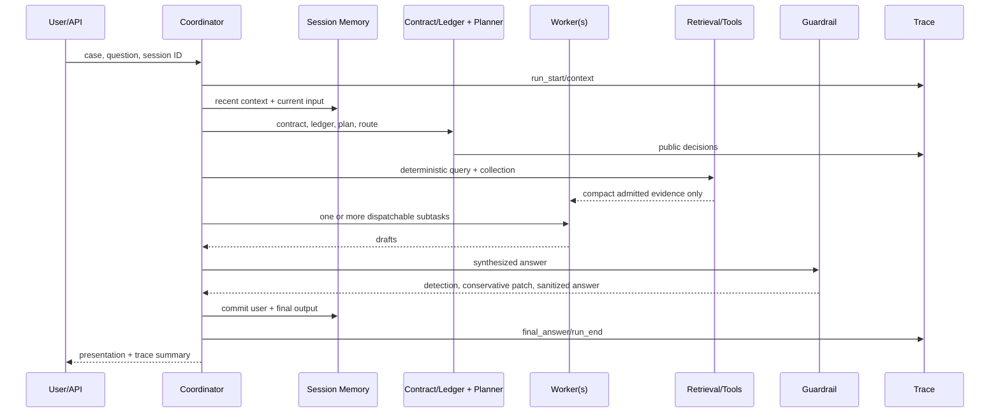

# Architecture

## End-to-end call flow

## Module contracts

| Module | Input | Output | State | Failure behavior |
|---|---|---|---|---|
| Context | question/case | AnswerContract, EvidenceLedger | none | validation rejects malformed structures |
| Session memory | session ID/messages | trimmed recent context | in-process, per session | exact adjacent duplicates ignored |
| Planner | contract/question | dispatchable Plan | none | deterministic valid fallback |
| Router | Plan | single/multi Route | none | diagnostic single-worker fallback |
| Tool runtime | worker/tool/arguments | handler result | registered handlers | visibility checked again at execution |
| RAG | task context/tool intent | EvidenceBundle | backend-owned | empty bundle; no fabricated evidence |
| Workers | subtask/compact evidence | WorkerResult | none | failure isolated; successful drafts retained |
| Synthesis | successful drafts | professional answer | none | deterministic concatenation fallback |
| Guardrail | answer/contract | findings + optional exact patch | none | ambiguous edit preserves original |
| Trace | public execution events | JSONL + summary | run directory | error event then closed failed lifecycle |
| Presentation | final artifacts | three-view response | none | empty safe fields rather than invented facts |

Single-agent mode avoids unnecessary synthesis overhead. Multi-agent mode runs
independent worker calls concurrently, while planning and final synthesis remain
centralized. Procedural skills are explicitly loaded files; tool schemas are
capability interfaces and are not skills.

The trace may contain case text and must be treated as sensitive in real
deployments. Run directories are ignored by Git. It never records API keys or
private chain-of-thought.

